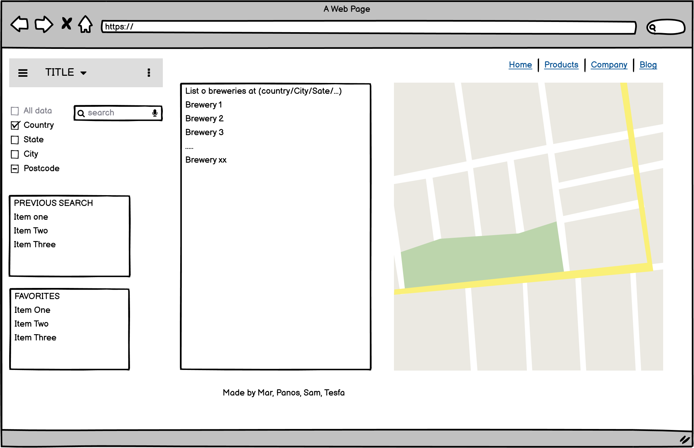

# Project Requirements
With your team, you'll conceive and execute a design by integrating data received from 
multiple server-side API requests.
You'll implement feature and bug fixes using Git branch workflow and pull requests.

Create own user stories and acceptance criteria. Use for GitHub Issues to stay on track

Use GitHub Project (Kanban boards) to track the status of your tasks.

# MUST INCLUDE

- Use a CSS framework other than Bootstrap. 
    Bulma (https://bulma.io/) or Materialize (https://materializecss.com)
    Probably going with bulma

- Be deployed to GitHub Pages.

- Be interactive (accept and respond to user input).

- Use at least two server-side APIs Links to an external site.

- Use modals and NOT alerts, confirms, or prompts. 
    EXAMPLE (https://www.w3schools.com/howto/howto_css_modals.asp)

- Use local storage store persistent data.

- Be responsive.

- Have a polished UI.

- Have a clean repository that meets quality coding standards 
    (file structure, naming conventions, best practices for 
    class/id naming conventions, indentation, quality comments, and so on).

- Have a quality README (including a unique name, 
    description, technologies used screenshot, 
    and a link to the deployed application).
    
# APIs
-GOOGLE MAPS
(https://developers.google.com/maps)
-OPEN BREWERY
(https://www.openbrewerydb.org/documentation)

# USER STORY
As a user 
I want to find a brewery in an area that I plan to visit
So that I can see what is local to the area

# ACCEPTANCE CRIRERIA

* GIVEN I WOULD LIKE TO FIND A BREWERY IN AN AREA

* WHEN I LOAD THE APP, THEN I SEE A CLEAN AND MOBILE FRIENDLY DESIGN
    
* WHEN I SEARCH FOR A CTIY, THEN IT IS SAVED IN PREVIOUS SEARCH

* WHEN I SEARCH FOR A CITY, THEN UP TO 10 LOCAL BREWERIES ARE LISTED

* WHEN I CLICK A LISTED BREWERY, THEN I AM SHOWN A NEW PAGE
* WHEN I VIEW THE NEW PAGE, THEN I AM PRESENTED WITH A MAP WITH A PIN IN THE BREWERY LOCATION, ABILITY TO VISIT WEBSITE, AND CAN GO BACK TO MAIN PAGE
* Then it is added to the favorites list

# WIREFRAME

